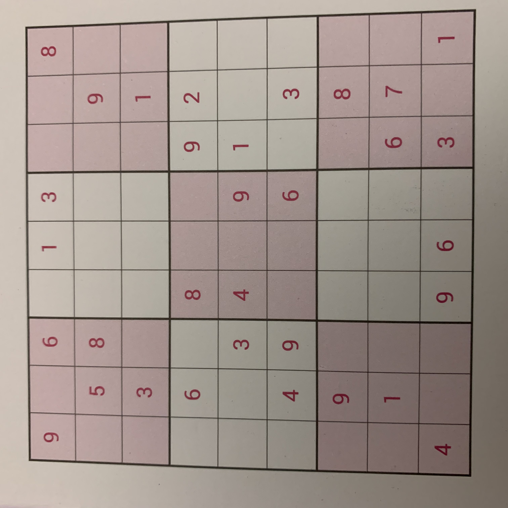
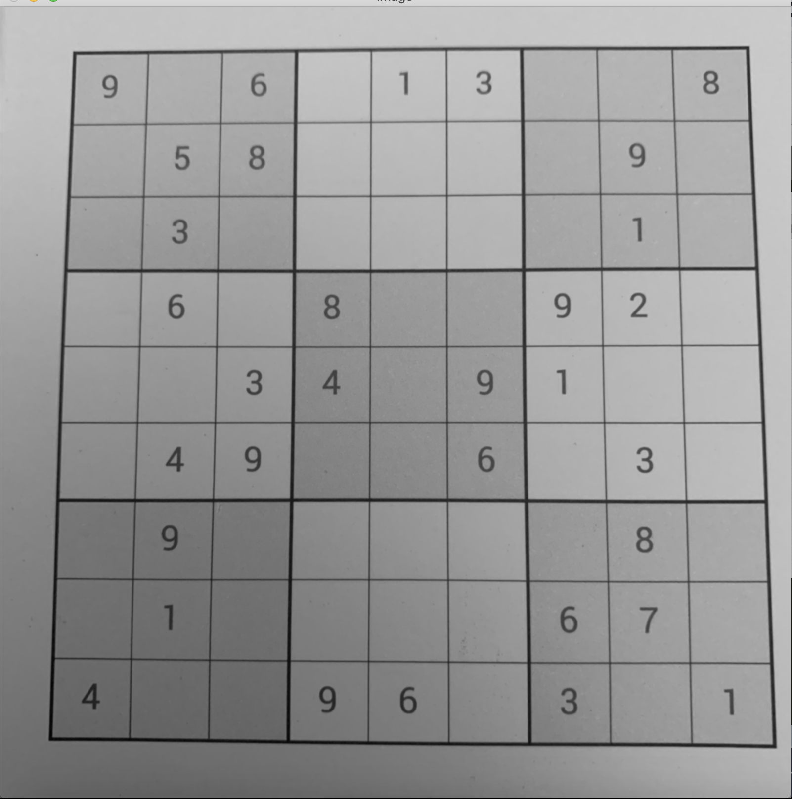
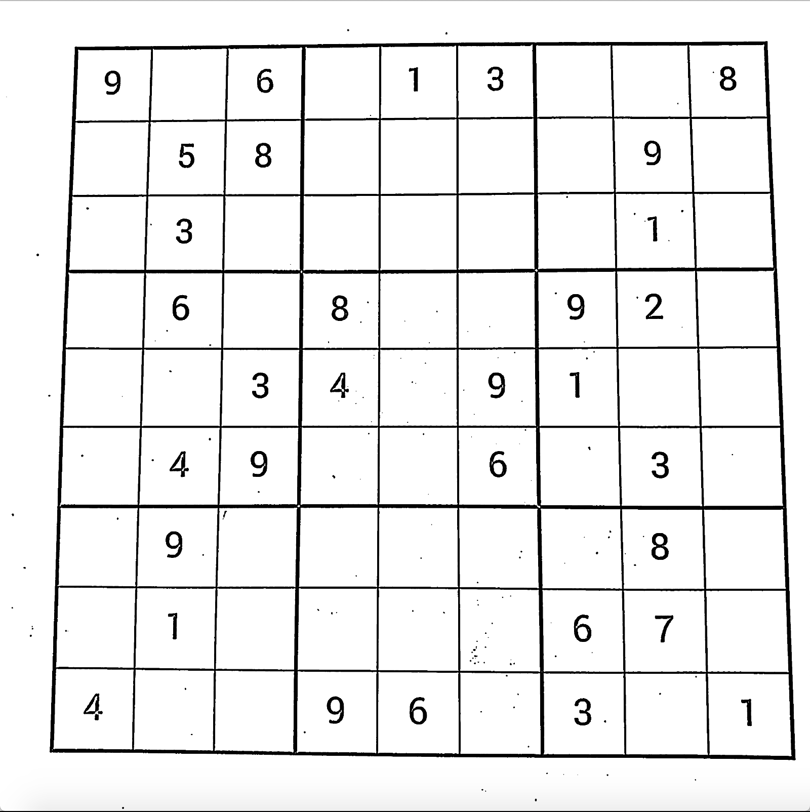

# Sudoku-Grabber
This is a self project aimed at using Computer Vision to detect and solve sudokus from images. This was done by me during Summer 2020, with aim of understanding the application Machine Learning.

The structure of the project was as follows - 
1. First train a convolutional neural network on the MNIST dataset for handwritten digit recognition. This was done using Keras.
2. Segment the sudoku in images. This was a hard task and employed various functions in OpenCV. This is described in detail later
3. Solving the recognized sudoku. This was done by a backtracking algorithm written in Python.

## Training the Neural Network
The neural network was trained on the MNIST dataset. This is a pretty standard ML problem that almost all the beginners do. Reference was mainly taken from [here](https://machinelearningmastery.com/how-to-develop-a-convolutional-neural-network-from-scratch-for-mnist-handwritten-digit-classification/), although a lot of other resources on the net were used, and a bit of experimentation as well. 

## Segmenting the Sudoku in Images
The test image was    
First, the Gaussian Blur was applied to smoothen the image. The image after this is given by   
The next step involved differentiating the light and dark parts of the image. This was done to recognise the numbers and the boundary lines of the sudoku as distinct from the background region. This was done by thresholding the image.   
