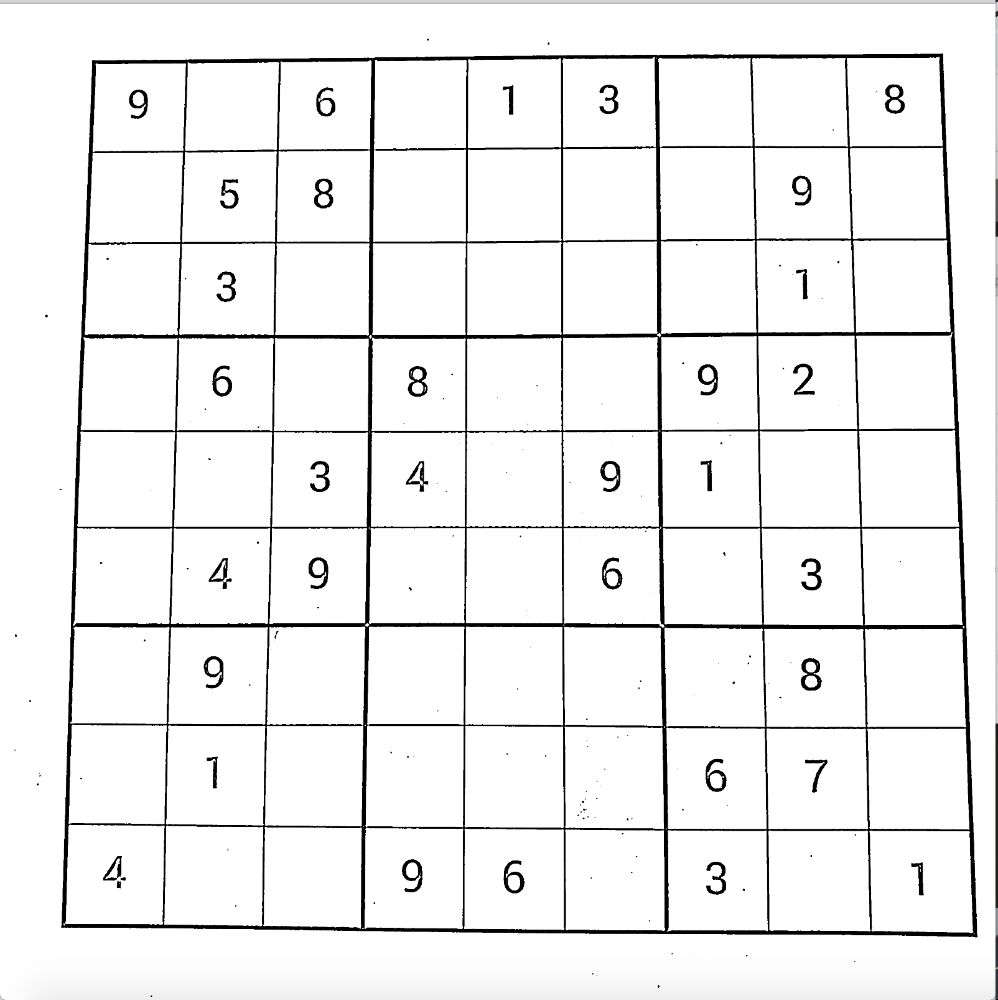
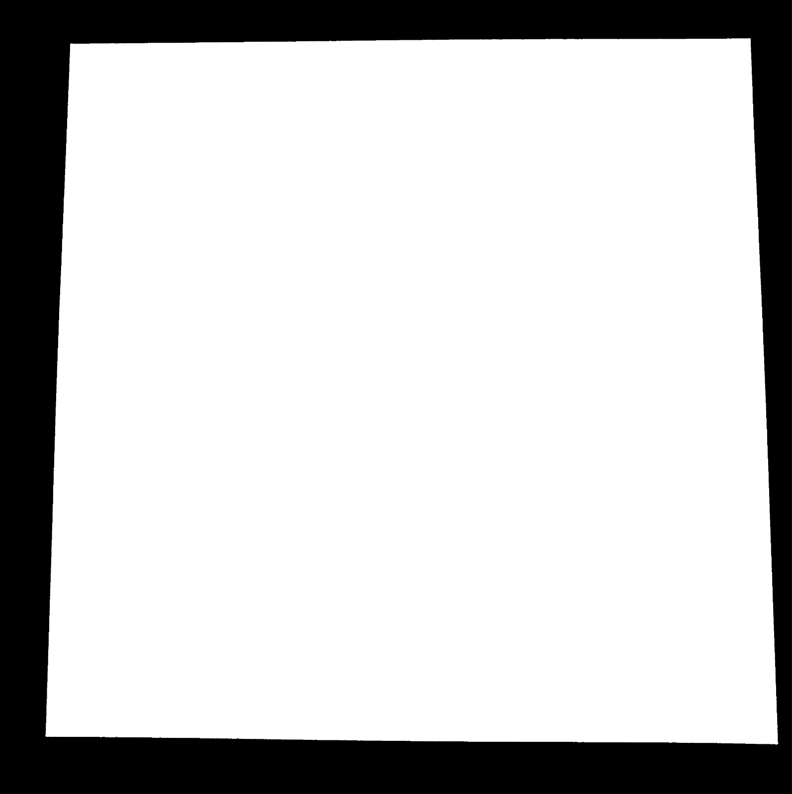
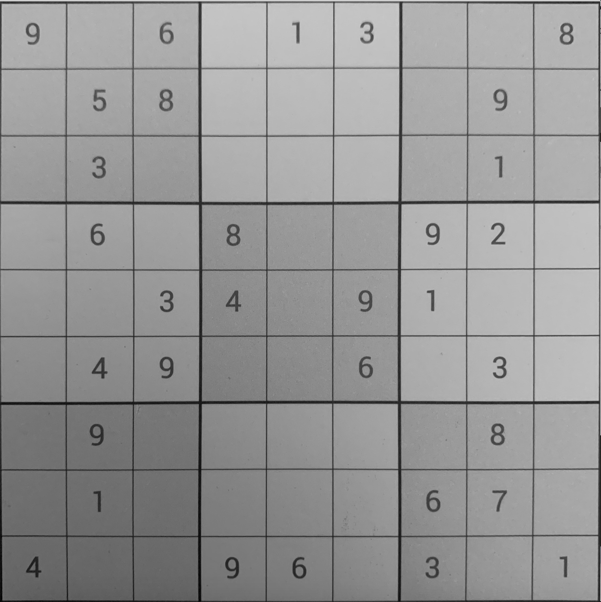
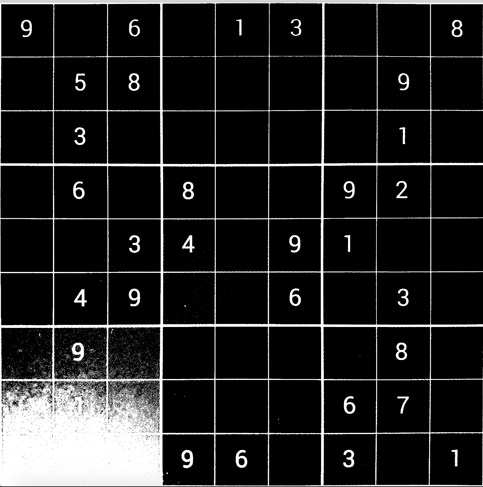
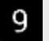
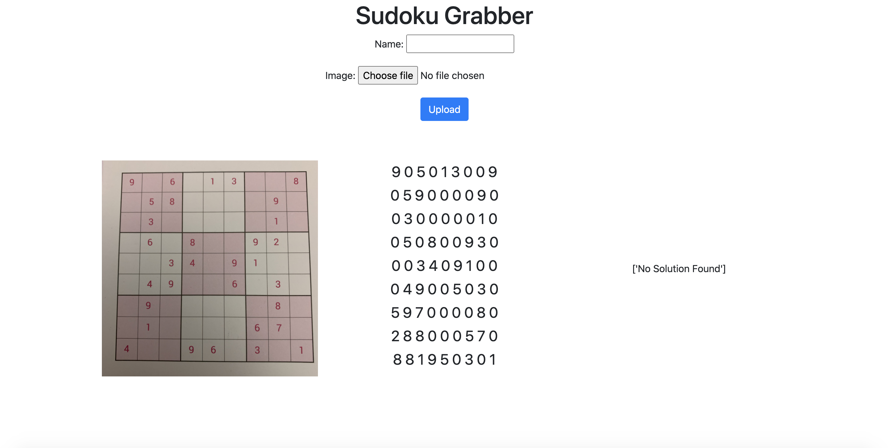

# Sudoku-Grabber
This is a self project aimed at using Computer Vision to detect and solve sudokus from images. This was done by me during Summer 2020, with aim of understanding the application Machine Learning.

The structure of the project was as follows - 
1. First train a convolutional neural network on the MNIST dataset for handwritten digit recognition. This was done using Keras.
2. Segment the sudoku in images. This was a hard task and employed various functions in OpenCV. This is described in detail later
3. Solving the recognized sudoku. This was done by a backtracking algorithm written in Python.

## Training the Neural Network
The neural network was trained on the MNIST dataset. This is a pretty standard ML problem that almost all the beginners do. Reference was mainly taken from [here](https://machinelearningmastery.com/how-to-develop-a-convolutional-neural-network-from-scratch-for-mnist-handwritten-digit-classification/), although a lot of other resources on the net were used, and a bit of experimentation as well. 

## Segmenting the Sudoku in Images
The test image was    
First, the Gaussian Blur was applied to smoothen the image. The image after this is given by   
The next step involved differentiating the light and dark parts of the image. This was done to recognise the numbers and the boundary lines of the sudoku as distinct from the background region. This was done by thresholding the image.   

To reduce the noise further in the image, it was eroded. What this basically did was replace the regions where there is very less "0" valued pixels into pixel values of "255".  

Now, to recognise where the sudoku lies, the contours of the image were found which are basically the continuous curves joining the points with same pixel value. The result is shown on a fully black image with the white area representing where the image lied.    

The corner points coordinates were found the image was cropped using the `getPerspectiveTransform` function in OpenCV. The result was   

This image after some more preprocessing was thresholded to obtain black and white images which are originally present in the MNIST dataset. The images below represent the thresholded image and the image obtained for each individual cell of the sudoku.   
 

## Solving the sudoku
The final step involved solving the sudoku. This was done by a backtracking algorithm, inspired from a [video](https://www.youtube.com/watch?v=G_UYXzGuqvM) of Computerphile . The code for the same can be found [here]('form/solve_sudoku.py')

## Deploying a webapp
The project was deployed using Django. `Django Signals` were used to use the image uploaded by the user for further processing and producing the final results. The results are shown below   

## Running the project on your system
Make sure you have the following dependencies installed with the same version. Otherwise there might be issues on using it locally 
1. tensorflow==2.2.0
2. Django==3.0.4
3. numpy==1.18.1
4. opencv-contrib-python==4.2.0.32

If there are any other packages to be required, I have attached my [pip freeze](pip_freeze.txt). You can check it out and install the required dependency.
